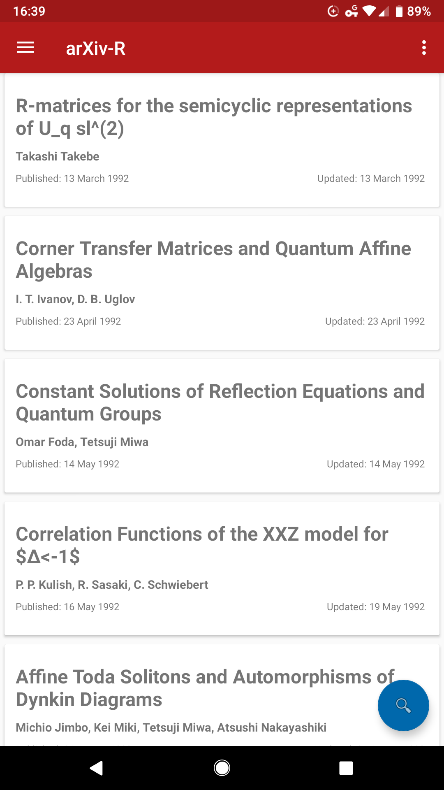

# arXiv-R
### an unofficial android app

**Development on hold until arXiv 2.0 API changes complete**

#### but y make this, tho?
The existing arXiv app doesn't have the functions I want, so I'm making this.
This is my first project in Java, so code tips and suggestions are very welcome.

#### Currently working on:
- "More articles" card

#### Remaining tasks:
- Make the actual widget, yo. You know, the whole reason you started this timesink in the first place.
- Expand to all fields and categories (remember pdf thing)
- Auto-update

#### Done
- Recyclerview
- Card expansion
- Local list storage
- Check last update
- Sharing
- Make articles accessible
- Store and open PDFs
- Settings activity. This should be an activity.
- Finish designing custom search dialog
- Bookmarks
- Sort your backstacks out, yo.

#### Pretty much done...
- Search functionality
- URL standardization
- Favorites
- Icon ... it's done, just need to implement it

#### Maybe if I have time later...
- Add sub-section filtering
